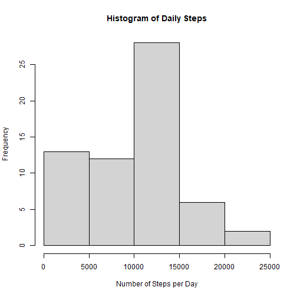
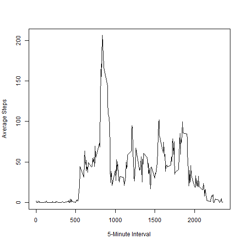
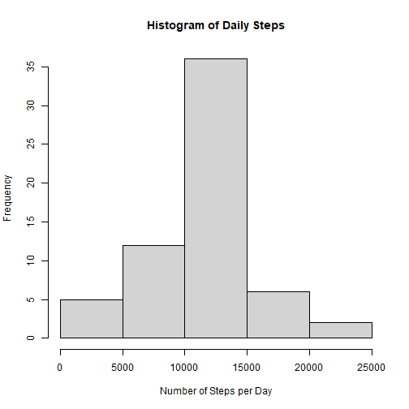
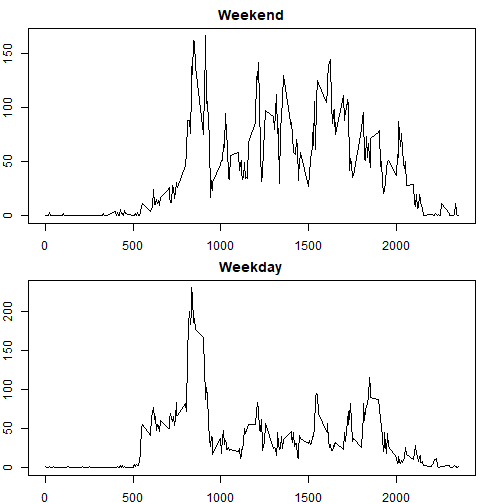

## Loading and preprocessing the data

First, we read in the provided data for processing.


```r
act <- read.csv('activity.csv')
```

## What is mean total number of steps taken per day?

Now we will group the number of steps taken per day and rename the resulting columns for ease of use.


```r
by_day <- aggregate(act$steps, by = list(act$date), sum, na.rm = T)
colnames(by_day)[1] <- 'date'
colnames(by_day)[2] <- 'steps'
```

We will now chart the number of steps per day in a histogram.


```r
hist(by_day$steps
     , xlab = 'Number of Steps per Day'
     , main = 'Histogram of Daily Steps')
```



What are the mean and median number of steps taken per day?

Mean: 9354.23 steps per day \
Median: 10395 steps per day

## What is the average daily activity pattern?

We will now group the number of steps taken per 5-minute interval.


```r
by_interval <- aggregate(act$steps, by = list(act$interval), mean, na.rm = T)
colnames(by_interval)[1] <- 'interval'
colnames(by_interval)[2] <- 'steps'
```

What does this data look like over time?


```r
plot(x = by_interval$interval
     , y = by_interval$steps
     , type = "l"
     , ylab = 'Average Steps'
     , xlab = '5-Minute Interval'
     , ylim = c(0,max(by_interval$steps)))
```



And which 5-minute interval as the highest number of steps?


```r
print(by_interval$interval[which.max(by_interval$steps)])
```

```
## [1] 835
```

## Imputing missing values

How many missing values are present in the original data?

```r
sum(is.na(act$steps))
```

```
## [1] 2304
```

We will now take care of the missing values in the original dataset by taking the average number of steps per interval.


```r
act_full <- act ## create a copy of original dataset to edit.

## fill in the missing values from our previous by_interval dataset where the interval value matches.
act_full$steps[is.na(act_full$steps)] <- by_interval$steps[match(act_full$interval,by_interval$interval)][which(is.na(act_full$steps))]
```

And calculate the total number of steps per day as before.

```r
by_day_full <- aggregate(act_full$steps, list(act_full$date), sum)
colnames(by_day_full)[1] <- 'date'
colnames(by_day_full)[2] <- 'steps'
```

We will now plot the resulting data in a histogram.


```r
hist(by_day_full$steps
     , main = 'Histogram of Daily Steps'
     , xlab = 'Number of Steps per Day')
```




How does this new set of data compare to our previous set with the missing values?\
Mean:\
&nbsp; With missing values: 9354.23\
&nbsp; With imputed values: 10766.19\
Median:\
&nbsp; With missing values: 10395\
&nbsp; With imputed values: 10766.19\

It looks like both the mean and median values increased when we imputed the missing data, which makes sense, given that the original dataset was weighted towards lower values and the new data is much more centered around the mean.

## Are there differences in activity patterns between weekdays and weekends?

We will first create a new factor variable denoting whether an observed date is a Weekday or Weekend.


```r
act_full$dayofweek <- weekdays(as.Date(act_full$date), abbreviate = T)
act_full$is_weekday <- with(act_full, ifelse(act_full$dayofweek %in% c('Mon', 'Tue', 'Wed', 'Thu', 'Fri'), 'Weekday', 'Weekend'))
```

Then group the number of steps per interval.

```r
## create individual data frames and rename the resulting columns.
by_interval_weekend <- aggregate(act_full$steps[act_full$is_weekday == 'Weekend'], list(act_full$interval[act_full$is_weekday == 'Weekend']), mean)
colnames(by_interval_weekend)[1] <- 'interval'
colnames(by_interval_weekend)[2] <- 'steps'


by_interval_weekday <- aggregate(act_full$steps[act_full$is_weekday == 'Weekday'], list(act_full$interval[act_full$is_weekday == 'Weekday']), mean)
colnames(by_interval_weekday)[1] <- 'interval'
colnames(by_interval_weekday)[2] <- 'steps'
```

And finally plot each set of data.

```r
par(mfrow = c(2,1), mar = c(2,2,2,2))

plot(x = by_interval_weekend$interval
     ,y = by_interval_weekend$steps
     ,main = 'Weekend'
     ,type = 'l'
     ,xlab = ''
     ,ylab = ''
)

plot(x = by_interval_weekday$interval
     ,y = by_interval_weekday$steps
     ,main = 'Weekday'
     ,type = 'l'
     ,xlab = 'Interval'
     ,ylab = ''
)
```


